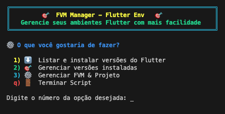
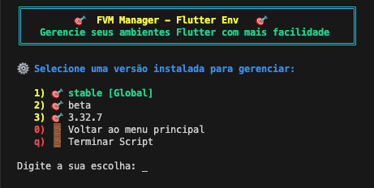

# 🎯 FVM Manager - Flutter Env 🎯


Um script de shell interativo e amigável para simplificar o gerenciamento de múltiplas versões do SDK do Flutter através do **FVM (Flutter Version Management)**.

---

### Tabela de Conteúdos
1.  [Contexto e Motivação](#contexto-e-motivação)
2.  [O que é o FVM?](#o-que-é-o-fvm)
3.  [Funcionalidades do Script](#funcionalidades-do-script)
4.  [Pré-requisitos](#pré-requisitos)
5.  [Como Usar](#como-usar)
6.  [Screenshots](#screenshots)

---

## Contexto e Motivação

Gerenciar diferentes versões do SDK do Flutter para múltiplos projetos pode ser uma tarefa complexa e repetitiva. Ferramentas como o **FVM** são extremamente poderosas, mas exigem a memorização de diversos comandos e argumentos de terminal.

Este script nasceu da necessidade de criar uma camada de abstração sobre o FVM, oferecendo uma **interface visual, interativa e intuitiva baseada em menus**. O objetivo é acelerar o fluxo de trabalho, reduzir erros e centralizar todas as operações comuns de gerenciamento de versões em um único lugar, tornando o processo acessível até para quem não tem familiaridade com todos os comandos do FVM.

## O que é o FVM?

**FVM (Flutter Version Management)** é uma ferramenta de linha de comando (CLI) que permite instalar, gerenciar e alternar entre diferentes versões do SDK do Flutter de forma simples e eficiente. Ele é amplamente adotado pela comunidade Flutter por resolver problemas comuns, como:

-   **Versão por Projeto:** Permite associar uma versão específica do Flutter a cada projeto, garantindo que toda a equipe de desenvolvimento use exatamente o mesmo ambiente e evitando problemas de compatibilidade.
-   **Versão Global:** Permite definir uma versão padrão ("global") do Flutter para ser usada em qualquer diretório que não tenha uma versão de projeto específica.
-   **Isolamento:** Mantém os SDKs instalados em um local centralizado, evitando conflitos entre diferentes projetos com diferentes requisitos de versão.

## Funcionalidades do Script

Este script encapsula os comandos do FVM em menus fáceis de usar, oferecendo as seguintes funcionalidades:

#### ⚙️ **Instalação e Gerenciamento do FVM**
-   Detecta automaticamente se o FVM está instalado.
-   Oferece a opção de **instalar ou desinstalar o FVM** diretamente pelo menu.
-   Ajuda a **configurar o `PATH`** do seu sistema (`~/.zshrc`) para uma integração perfeita com o FVM.

#### ⬇️ **Gerenciamento de Versões do Flutter**
-   Lista todas as versões **stable** disponíveis para instalação, com um menu de seleção numérica.
-   Oferece uma interface para instalar versões **beta** por nome.
-   Exibe todas as suas versões já instaladas.
-   Indica visualmente qual versão está definida como **`[Global]`** ou **`[Local]`**.

#### 🎯 **Operações por Projeto e Globais**
-   Permite definir qualquer versão instalada como a versão **global** padrão.
-   Permite definir qualquer versão instalada para ser usada apenas no **projeto atual**.
-   Oferece a opção de **remover** SDKs que não são mais necessários para liberar espaço em disco.
-   Limpa as configurações do FVM de um projeto (`.fvm` folder).

#### ✨ **Interface Amigável**
-   Menus coloridos e com emojis para uma navegação clara e agradável.
-   Prompts e confirmações para todas as ações importantes, evitando operações acidentais.
-   Opções de navegação consistentes, com "Voltar" (`0`) e "Terminar Script" (`q`) disponíveis em todos os menus.

## Pré-requisitos
-   Um terminal Unix-like (Linux, macOS). O script foi desenvolvido e testado em **zsh**.
-   O **SDK do Dart** instalado no sistema (geralmente incluído em qualquer instalação do Flutter).

## Como Usar
1.  Salve o código do script em um arquivo, por exemplo: `fvm-manager.sh`.
2.  Abra o terminal e dê permissão de execução ao arquivo:
    ```bash
    chmod +x fvm-manager.sh
    ```
3.  Execute o script:
    ```bash
    ./fvm-manager.sh
    ```
4.  Navegue pelos menus usando os números das opções.

## Screenshots

#### Menu Principal



#### Gerenciando Versões Instaladas
